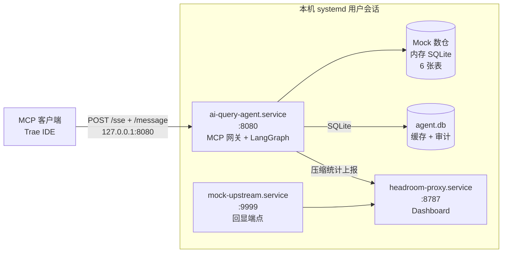

# AI Query Agent — MCP 问数服务端（Nix + systemd 部署）

面向 MCP 客户端（Trae / 任意 MCP host）的企业级"智能问数"服务端。

**两条设计前提（务必先读）**

1. **服务端不调用任何 LLM。** SQL 由调用方（Trae 等客户端）用其自有 token 生成，
   服务端只负责元数据、SQL 审查、执行、结果解读与压缩统计。
   内置的 `ask_question` 用规则生成 SQL，定位是"开箱即用的演示链路"；
   需要精确 SQL 时调用方直接走 `execute_sql` 传入自己写的 Hive SQL。
2. **数据源是 Mock 数仓，不是 Hive。** 6 张 Hive 风格表由内存 SQLite 承载并真实执行 SQL
   （GROUP BY / JOIN / 子查询 / CTE / 窗口函数 / 常用 Hive 函数全部可用），
   表结构与种子数据在 `datasource/mock_warehouse.py` 中确定。
   将来接真实 Hive 时替换该模块即可，`CATALOG / describe / search / execute` 接口不变。

---

## 架构

部署形态为 **Nix（解释器 + 工具链）+ 两个 venv（Python 依赖）+ 三个 systemd 用户单元（进程托管）**，不依赖 Docker。



三个单元各自职责：

| 单元 | 端口 | 说明 |
|------|------|------|
| `ai-query-agent` | 8080 | MCP 网关 + LangGraph 8 节点工作流 + Mock 数仓 + SQLite 缓存/审计 |
| `headroom-proxy` | 8787 | SmartCrusher 压缩统计看板（`/dashboard`） |
| `mock-upstream` | 9999 | 仅本机可见的回显端点，充当代理的上游，用于验证压缩统计链路 |

三个端口默认都只监听 `127.0.0.1`。

---

## 快速开始（WSL / Linux + systemd）

前置：Determinate Nix（flakes 已启用）、systemd 作为 PID 1、`curl`。

```bash
bash deploy-nix.sh                 # 默认：准备 venv + 安装并启动单元 + 健康检查 + 冒烟
bash deploy-nix.sh --status        # 单元状态 + /health
bash deploy-nix.sh --stop          # 停止并禁用三个单元
bash deploy-nix.sh --test          # 跑单元测试
bash deploy-nix.sh --logs          # 跟踪网关日志
```

`deploy-nix.sh` 做的事：

1. `nix build --out-link ~/.local/state/ai-query-agent/nix-python .#python`
   （GC root 固定解释器，避免 `nix-collect-garbage` 删掉 venv 依赖的 Python；
   该输出同时并入 `gcc.cc.lib`，供 venv 里的 C++ wheel（onnxruntime 等）
   在运行期找到 `libstdc++`——`scripts/lib.sh` 据此导出 `LD_LIBRARY_PATH`）
2. `scripts/setup-venv.sh` 用两份 lock 建两个 venv
   （`requirements-agent.lock.txt` / `requirements-proxy.lock.txt`）
3. 生成 `~/.config/ai-query-agent/agent.env`（不存在时从 `.env.example` 复制，`chmod 600`）
4. 安装三个单元到 `~/.config/systemd/user/` 并 `systemctl --user enable --now`

在 WSL 会话结束后保持服务运行，需执行一次：

```bash
loginctl enable-linger $USER      # polkit 通常直接放行；若提示需要认证则加 sudo
```

未执行 linger 时，服务在 WSL 会话存续期间正常运行。

端口被占用时，改 `~/.config/ai-query-agent/agent.env` 中的端口；
`HEADROOM_PORT` 与 `HEADROOM_PROXY_URL` 必须同步修改，然后 `bash deploy-nix.sh`。

手工操作：

```bash
systemctl --user status ai-query-agent
curl -s http://127.0.0.1:8080/health | python3 -m json.tool
journalctl --user -u ai-query-agent -f
```

开发 shell：

```bash
nix develop                 # Python 3.11 + gcc + libstdc++；不自动装依赖
bash scripts/setup-venv.sh  # 显式准备依赖（幂等，--force 重建）
nix run .#agent             # 前台运行网关
nix run .#test              # 跑测试
```

---

## Mock 数仓

内存 SQLite，6 张表，约 4.4 万行，进程启动时构建（~0.2s）。

| 表 | 行数 | 说明 |
|----|------|------|
| `dwd_sale_order_di` | 14,640 | 销售订单明细（按日分区） |
| `dwd_sale_order_item_di` | 14,640 | 销售订单行项目 |
| `dim_product_df` | 20 | 产品维度（品类 / 品牌 / 售价） |
| `dim_store_df` | 20 | 门店维度（区域 / 城市 / 开业日期） |
| `dwd_traffic_visit_di` | 7,320 | 到店流量（一行一店一天） |
| `dwd_customer_visit_di` | 7,320 | 客户到访明细 |

- **mock 时钟固定为 `2025-01-01`**，数据区间 `2024-01-01 ~ 2024-12-31`。
  `date_sub(current_date(), N)` 因此永远有数据，结果不随真实日期漂移。
- 数据由固定种子生成，**同样的 SQL 永远得到同样的结果**；含季节波动与周末放大，趋势/对比查询有真实形状。
- 已注册 Hive 函数：`date_sub` `date_add` `datediff` `current_date()` `current_timestamp()`
  `nvl` `concat` `concat_ws` `substring` `to_date` `year` `month` `day` `date_format`。
- **边界**：仅允许单条 `SELECT`/`WITH`；写操作、多语句被拒绝；日期字面量直接加减
  （`'2025-01-01' - 30`）会报错，请用 `date_sub/date_add`；单次返回行数上限 `MOCK_MAX_ROWS`（默认 500，超出标记 `truncated`）。

---

## MCP 工具（9 个）

服务端在 `initialize` 响应里通过 MCP 标准字段 `instructions` 下发用法指引，
工具列表也按调用顺序排列，客户端 LLM 接入即知链路。

**推荐问数链路（主力，SQL 由调用方 LLM 生成）**

| 步骤 | 工具 | 作用 |
|------|------|------|
| 1 | `search_tables` | 探查表。**不带 keyword 返回全部表**；带关键词（支持中文）按表名/注释检索 |
| 2 | `query_metadata` | 取目标表的列名、类型、注释、分区键、行数 |
| 3 | — | 客户端 LLM 依据表结构编写 Hive SQL |
| 4 | `validate_sql` | （可选）执行前静态审查 |
| 5 | `execute_sql` | **主力工具**：执行 SQL，返回 `rows / columns / row_count` |

其他工具：

| 工具 | 用途 |
|------|------|
| `ask_question` | 内置规则式演示链路（服务端不调 LLM）。只覆盖「时间窗口 + 区域/门店/产品维度」类简单问题，**非主力** |
| `get_workflow_status` | 按 session_id 查会话状态 |
| `get_cache_stats` | 三级缓存 + 压缩 + DB 统计 |
| `get_headroom_stats` | 压缩统计 |
| `get_audit_logs` | 审计日志（可按 `client_session`（一段会话）/ `session_id`（一次工作流）/ `trace_id`（一次调用）过滤；`limit` 钳制在 1~500，非法值回退 20） |

传输端点：

```
GET  /sse                           MCP 标准 SSE（Trae 配置此地址）
POST /message?session_id=<id>       JSON-RPC：initialize / tools/list / tools/call
POST /mcp                           旧版兼容：method="tools/<name>"
POST /tools/<tool_name>             裸 REST（curl 调试用）
GET  /health   GET /tools
```

请求体上限由 `MCP_MAX_BODY_BYTES` 控制（默认 256 KiB），超限返回 JSON 格式的 413。

### Trae MCP 配置

```json
{
  "mcpServers": {
    "ai-query-agent": {
      "url": "http://localhost:8080/sse",
      "type": "http"
    }
  }
}
```

### 客户端 LLM 的行为约束（已写入 instructions 与工具描述）

- 时间范围用 `date_sub(current_date(), N)`；不要写 `date '...'` 或 `'yyyy-MM-dd' - N`（会被拒绝）
- 仅单条 `SELECT`/`WITH`；写操作、多语句会被拒绝
- SQL 报错原样返回在 `sql_error` / `errors` 字段，据此改写后重试
- 列名以 `query_metadata` 结果为准，不要凭猜测拼列名

---

## 工作流（8 节点）

```
START → cleanup → analyze → metadata → sql_generation → validation
      → (retry ↻ sql_generation | pass/force_pass → execution → interpretation → audit → END)
```

| 节点 | 实现 |
|------|------|
| cleanup | 提问归一化 + 压缩 |
| analyze | 意图/复杂度/关键词/业务标签（正则，无 LLM） |
| metadata | 按 2-gram 重合度选表 + 查表结构（带缓存） |
| sql_generation | 规则生成：从问题解析时间窗口与维度（无 LLM） |
| validation | SQL 白名单/危险词/括号/多语句审查，失败重试 |
| execution | 在 Mock 数仓真实执行 + 结果缓存 + 压缩 |
| interpretation | 摘要、关键指标、图表建议 |
| audit | 写 `sessions` + `audit_logs` |

---

## 配置

见 `.env.example`（其中每个变量都被代码实际读取）。`deploy-nix.sh` 会把它复制到
`~/.config/ai-query-agent/agent.env`，由三个单元通过 `EnvironmentFile` 读取。
systemd 的 `EnvironmentFile` 不做变量展开，因此该文件里的 `AGENT_DATA_DIR` 必须是绝对路径。

| 变量 | 默认 | 说明 |
|------|------|------|
| `AGENT_DATA_DIR` | `<state>/data` | SQLite 数据目录（缓存 + 审计） |
| `MOCK_MAX_ROWS` | 500 | 单次查询返回行数上限 |
| `MCP_HTTP_HOST` / `MCP_HTTP_PORT` | `127.0.0.1` / 8080 | 网关绑定地址 |
| `MCP_WORKERS` | 1 | gunicorn worker 数（SSE 会话表是进程内字典，必须为 1） |
| `MCP_THREADS` | 16 | gthread 线程数 |
| `MCP_SERVER` | gunicorn | 设为 `flask` 可回退到 Flask 内置服务器 |
| `MCP_MAX_BODY_BYTES` | 262144 | 请求体上限 |
| `CACHE_CLEANUP_INTERVAL_SEC` | 300 | 后台回收间隔；<=0 关闭 |
| `AUDIT_RETENTION_DAYS` | 90 | 审计日志与会话保留天数 |
| `AGENT_LOG_LEVEL` | INFO | 日志级别 |
| `AGENT_LOG_JSON` | false | true 时输出 JSON 行日志 |
| `HEADROOM_ENABLED` | true | 是否启用压缩 |
| `HEADROOM_PROXY_URL` | `http://127.0.0.1:8787` | 统计上报地址 |
| `HEADROOM_REPORT_ENABLED` | true | 统计上报开关（固定 2 个守护线程 + 有界队列） |
| `HEADROOM_DEBUG` | true | 节点级调试日志 |
| `MOCK_UPSTREAM_HOST` / `MOCK_UPSTREAM_PORT` | `127.0.0.1` / 9999 | 回显端点绑定 |

数据持久化：`AGENT_DATA_DIR`（默认 `~/.local/state/ai-query-agent/data/agent.db`，
XDG state 目录），不再落在源码树内。
`db/schema.py` 带 `SCHEMA_VERSION` 迁移：版本变化时重建缓存表，`sessions/audit_logs` 保留。

依赖锁定：两个 venv 分别由 `requirements-agent.lock.txt` / `requirements-proxy.lock.txt`
完整 freeze 复现；`requirements-dev.txt` 只装进 agent venv。安装用
`pip install -r <lock>`，不要再写 `headroom-ai[proxy]`，否则 pip 会重新解析并偏离 lock。

---

## 审计与全链路追踪

**每个工具调用都落审计**（含直连 REST `/tools/<name>`、MCP `/message`、旧版 `/mcp`），
包括失败、被守卫拦截与未知工具：

| 落库位置 | 内容 |
|---|---|
| `audit_logs`（每次工具调用一行） | `node_name` = 工具名（或 `guard:body_limit`）、`latency_ms` 真实耗时、`input_data`/`output_data` 预览、`sql_text` 全量 SQL、`error`、`cache_hit`、`client`（User-Agent）、`remote_addr`、`trace_id`、`client_session` |
| `audit_logs`（工作流每步一行） | `workflow_step` = cleanup…interpretation，`created_at` 为该节点**真实结束时刻**、`latency_ms` 为该节点真实耗时、`compression_ratio` 为该步压缩比、`sql_text` 为该次问数的 SQL、`error` 取该步的校验/执行错误 |
| `sessions` | 整个问数终态：`status`、`trace_id`、`client_session`、起止时间、缓存命中、错误 |

三个标识各自回答一个问题，别混用：

| 列 | 粒度 | 值来源 |
|---|---|---|
| `trace_id` | **一次调用** | 网关生成，或客户端 `X-Trace-Id` 自带 |
| `client_session` | **一段会话** | MCP 的 `?session_id=`（SSE 流内所有调用共享）或 REST 的 `X-Client-Session` |
| `session_id` | **一次问数工作流** | `ask_question` 返回的 session_id |

**trace_id 贯穿全链路**：

- 网关 `before_request` 分配（客户端可用 `X-Trace-Id` 请求头自带），存入 contextvar；
- 响应头回传 `X-Trace-Id`，同时回传 `X-Client-Session`；
- 所有日志行带 `[trace_id]`（`AGENT_LOG_JSON=true` 时为结构化字段）；
- 工作流状态下发到每个节点，写入审计。

三种反查方式：

```bash
# a) 一段会话（如 Trae 一次提问的所有工具调用），时间正序
curl -s -X POST http://127.0.0.1:8080/tools/get_audit_logs \
  -H 'Content-Type: application/json' \
  -d '{"client_session":"<session_id>","limit":200}' | python3 -m json.tool

# b) 单次调用的完整链路（网关 + 各工作流节点）
curl -s -X POST http://127.0.0.1:8080/tools/get_audit_logs \
  -H 'Content-Type: application/json' -d '{"trace_id":"demo-1"}' | python3 -m json.tool

# c) 日志侧同一条链路
journalctl --user -u ai-query-agent --since "15 min ago" | grep demo-1
```

MCP 会话的 `session_id` 从 SSE 的 `event: endpoint` 里取，日志里的
`sse.session.open session_id=...` 也会打印。

守卫拦截也会留痕，例如请求体超限：

```
node_name = guard:body_limit
error     = 请求体超过上限 262144 字节
input_data= {"limit_bytes": 262144, "content_length": 300000}
```

`validate_sql` 判定 SQL 不安全时仍返回 200（保持原契约），但审计 `error` 会记下命中的规则，
并在日志打 `guard.flagged`。

---

## 运维

```bash
systemctl --user status ai-query-agent headroom-proxy mock-upstream
journalctl --user -u ai-query-agent -f
systemctl --user restart ai-query-agent
bash deploy-nix.sh --stop           # 停止并禁用

# 查库（数据目录来自 agent.env）
python3 -c "import sqlite3;c=sqlite3.connect('$HOME/.local/state/ai-query-agent/data/agent.db');print(c.execute('select count(*) from audit_logs').fetchone())"
```

后台维护线程会周期清理过期缓存并回收超期审计日志，日志形如：

```
[maintenance] 清理过期缓存 0 条，回收审计 12 条（保留 90 天）
```

---

## 与真实环境的差距

| 项 | 现状 |
|----|------|
| 数据源 | Mock 数仓（内存 SQLite）。接 Hive 需替换 `datasource/mock_warehouse.py` |
| SQL 生成 | `ask_question` 走规则；精确 SQL 由调用方生成后走 `execute_sql` |
| LLM | 服务端不调用，token 全部由调用方（Trae）消耗 |
| 压缩 | 本地 SmartCrusher + 统计上报；若要让外侧 LLM 流量真正被压缩，需把客户端的 `OPENAI_BASE_URL` / `ANTHROPIC_BASE_URL` 指向 `http://127.0.0.1:8787` |
| 认证 | 无。仅监听 127.0.0.1，勿直接暴露公网 |

## 许可证

MIT
